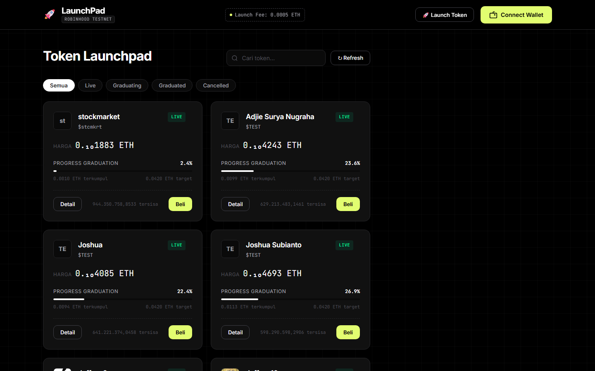
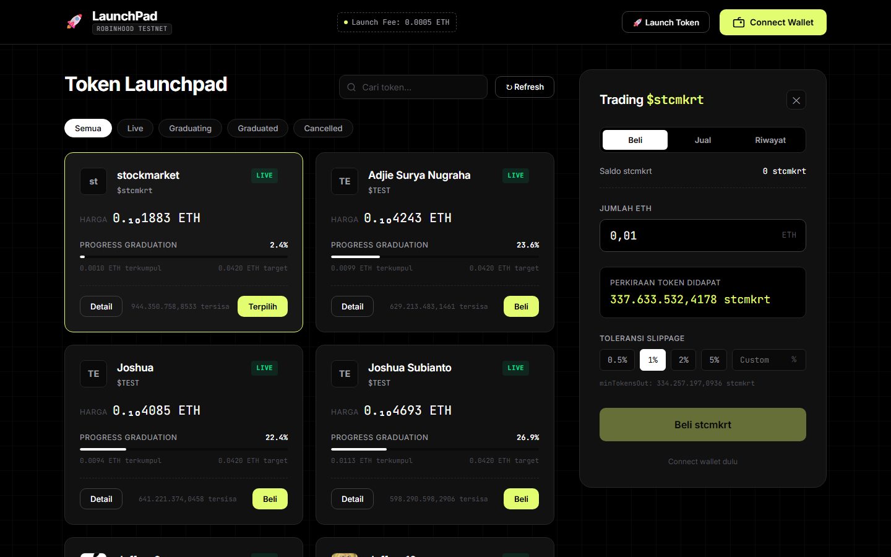
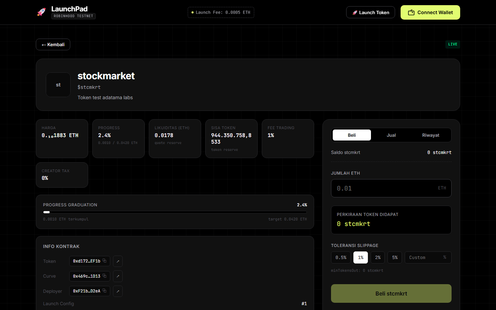
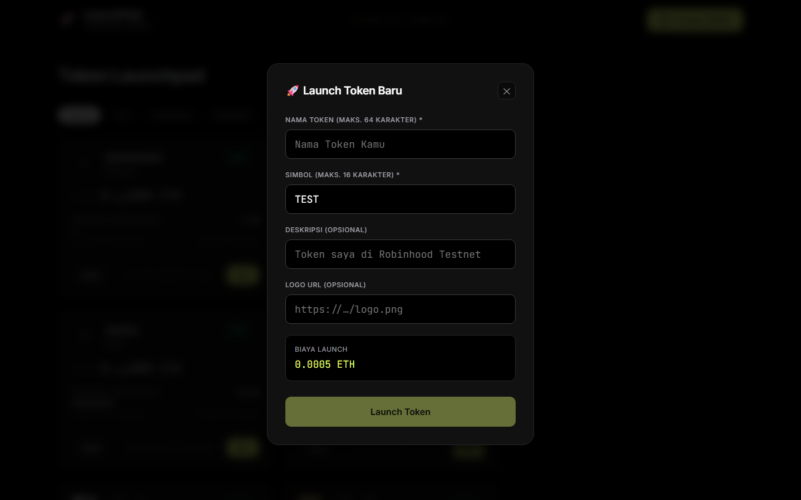
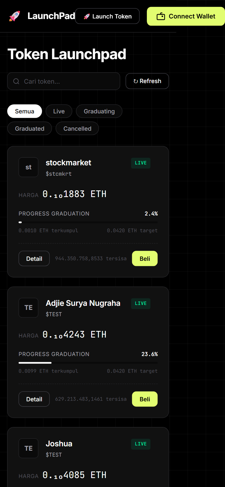

# Launchpad Token — Robinhood Chain Testnet

Frontend untuk menampilkan, membeli, menjual, dan meluncurkan token dari bonding curve
di **Robinhood Chain Testnet (Chain ID 46630 / `0xb626`)**.

## Screenshot Demo

| Desktop — daftar token | Desktop — panel beli |
| --- | --- |
|  |  |

| Desktop — detail token | Desktop — modal launch |
| --- | --- |
|  |  |

| Mobile — daftar token (390px) |
| --- |
|  |

---

## Cara Menjalankan

### Prasyarat
- Node.js ≥ 18
- npm ≥ 9
- Wallet EVM (MetaMask) di browser — transaksi butuh signature wallet

### Langkah

```bash
npm install
npm run dev        # dev server → http://localhost:5173
```

Perintah lain:

```bash
npm run lint       # oxlint
npm run build      # tsc -b && vite build (output di dist/)
npm run preview    # jalankan hasil build
```

### Konfigurasi Network

Tombol **Switch ke Robinhood Testnet** menambahkan/mengalihkan network secara otomatis
(`wallet_switchEthereumChain`, fallback `wallet_addEthereumChain`). Manual:

| Item | Nilai |
| --- | --- |
| Network Name | Robinhood Chain Testnet |
| Chain ID | **46630 (`0xb626`)** |
| RPC URL | `https://robinhood-sepolia-rpc.publicnode.com` |
| Currency | ETH |
| Explorer | `https://explorer.testnet.chain.robinhood.com` |

Kontrak:
- LaunchFactory: `0x533cE670f1372cb402D49866608b92e7bc2b4493`
- Multicall3: `0xcA11bde05977b3631167028862bE2a173976CA11`
- Block deploy factory: `129157568`

---

## Fitur (9 langkah + bonus)

| Langkah | Fitur | Status |
| --- | --- | --- |
| 1 | Setup project + baca `launchFee()` (cek koneksi RPC) | ✅ |
| 2 | Connect/disconnect wallet, saldo ETH, deteksi & switch network | ✅ |
| 3 | Fetch token dari event `TokenLaunched` (chunk `eth_getLogs` ≤ 50.000 blok) | ✅ |
| 4 | Enrich data via Multicall3 (nama, simbol, logo, reserves, phase) | ✅ |
| 5 | Daftar token: card, harga, progress graduation, badge phase | ✅ |
| 6 | Form beli: estimasi output, slippage, validasi saldo | ✅ |
| 7 | Kirim transaksi `buy()`, tampilkan semua status (pending/sukses/gagal) | ✅ |
| 8 | Refresh data setelah transaksi tanpa reload | ✅ |
| 9 | README + dokumentasi | ✅ |
| Bonus A | Jual token (`sell()`) dengan persentase & estimasi | ✅ |
| Bonus B | Riwayat transaksi dari event `CurveBuy` / `CurveSell` | ✅ |
| Bonus C | Halaman detail token (statistik, info kontrak, alamat copyable) | ✅ |
| Bonus D | Tombol graduate (`createGraduatedPool`) saat phase = Graduating | ✅ |
| Bonus E | Launch token baru (modal form `launchToken`) | ✅ |

---

## Keputusan Teknis

### Stack
- **React 19 + Vite + TypeScript** — build cepat, DX baik
- **wagmi 3 + viem** — akses chain type-safe
- **@tanstack/react-query** — cache & refetch untuk wagmi
- **oxlint** — lint tanpa konfigurasi berat

### Deteksi network salah
`useChainId()` pada wagmi 3 mengembalikan chain yang dikonfigurasi, bukan chain wallet.
Deteksi memakai `useAccount().chainId`, lalu `switchChainAsync()` dengan fallback
`wallet_addEthereumChain` (`numberToHex(46630)`). Saat network salah, semua aksi transaksi
dinonaktifkan dan banner peringatan ditampilkan.

### Chunked event fetching (langkah 3)
RPC membatasi `eth_getLogs`; implementasi memakai `BLOCK_CHUNK_SIZE = 49999` blok per
request, mulai dari block deploy `129157568` sampai `latest`. Polling ulang tiap **30 detik**
(hanya memperbarui data, tanpa skeleton agar daftar tidak berkedip).

### Multicall3 (langkah 4)
`Multicall3.aggregate3()` dengan `allowFailure: true` — 9 call per token
(`name`, `symbol`, `logo`, `getReserves`, `realQuoteReserve`, `graduationThreshold`,
`feeBps`, `creatorTaxBps`, `getLaunchedToken`) dijalankan dalam 1 request RPC untuk N token.

### ABI = sumber kebenaran kontrak
ABI diambil dari file `abi/*.json` yang disediakan brief (bukan hasil tebakan). Konsekuensinya
struct `getLaunchedToken` memakai 15 field asli (**tanpa `launchConfigId`** — nilai itu datang
dari event `TokenLaunched`), `getReserves()` mengembalikan `[quoteReserve, tokenReserve]`,
dan event `CurveSell` punya 6 parameter (`fee`, `tax`).

### Kalkulasi
Semua angka memakai `bigint`:

```
price           = quoteReserve × 10^18 / tokenReserve      (wei per token)
fee             = quoteIn × feeBps / 10000
creatorTax      = quoteIn × creatorTaxBps / 10000
tokensOut       = (quoteIn - fee - creatorTax) × tokenReserve / (quoteReserve + net)
minTokensOut    = tokensOut × (10000 - slippageBps) / 10000
progressBps     = realQuoteReserve × 10000 / graduationThreshold
```

Harga kecil ditampilkan dengan notasi subscript (`0.₅1234`).

### Phase on-chain
Enum kontrak: `FRESH=0`, `EARLY=0`, `HALF=1`, `TAXED=0`, `GRAD=2`.
Dipetakan ke UI: **Live / Graduating / Graduated / Cancelled**.

### Modal & panel
- Modal Launch Token di-`portal` ke `document.body` — header punya `backdrop-filter` yang
  menjadikannya *containing block* elemen `position: fixed`, sehingga tanpa portal overlay
  terkunci setinggi header dan modal terpotong.
- Panel trading berubah menjadi **bottom sheet** di bawah 1024px (dapat ditutup, punya
  bayangan & padding safe-area).

### Responsif
Diuji otomatis (CDP headless) pada lebar **1440, 1024, 768, 640, 480, 390, 360, 320 px**
pada tiga state (daftar, detail, modal): tidak ada overflow horizontal.

- ≤ 1024px: grid 1 kolom, panel trading jadi bottom sheet
- ≤ 640px: teks tombol header dipendekkan (`Launch`, `Connect`, `Switch`), logo mengecil,
  saldo disembunyikan (ada di dropdown), pencarian & refresh wrap
- ≤ 360px: tombol Launch jadi ikon
- Container query pada kartu: baris footer memecah baris agar supply tidak terpotong

### Error handling
`parseContractError()` menerjemahkan error kontrak (atau kotak 4 karakter):
`SlippageExceeded`, `CurveGraduated`, `MinimumOutputRequired`, `InsufficientLiquidity`,
`InsufficientInputAmount`/`ZeroAmount`, `InsufficientOutputAmount`, `NativeValueMismatch`,
penolakan user (kode 4001), dan saldo tidak cukup.

---

## Yang Belum Selesai / Keterbatasan

1. **Wallet sungguhan diperlukan untuk transaksi** — lingkungan headless tidak punya
   MetaMask, jadi alur `buy/sell/launch/graduate` hanya diverifikasi sampai tahap
   penyiapan transaksi & penanganan error.
2. **Token non-ETH** ditampilkan dengan badge "Non-ETH" tetapi form beli dinonaktifkan
   (pair token selain ETH belum didukung).
3. **Tidak ada unit/e2e test** — verifikasi dilakukan lewat lint, typecheck, build, dan
   pemeriksaan layout otomatis via CDP.
4. **Ukuran bundle besar** (≈638 kB, wagmi/viem) — belum dipecah dengan code-splitting.

---

## Bagian yang Dibantu AI

- Kerangka komponen React (App, TokenCard, BuyForm, WalletButton) dan design system CSS
- Struktur hook `useTokenList` (chunked `getLogs` + multicall) dan `useTxHistory`
- Debugging: struktur ABI yang tidak cocok, containing-block `backdrop-filter`, serta
  audit responsif lintas breakpoint
- Penulisan README ini

Logika Web3 (kalkulasi bigint, encoding/decoding multicall, alur transaksi, pembacaan
event) diverifikasi terhadap ABI resmi dan perilaku on-chain.

---

## Masalah yang Ditemukan

1. **ABI tidak konsisten dengan kontrak.** Struct `getLaunchedToken` dan signature event
   `CurveSell`/`CurveBuy` yang dipakai awalnya salah sehingga decode data gagal/salah.
   Diperbaiki dengan menyesuaikan persis ke `abi/*.json` dari brief.
2. **Modal Launch Token "hilang"/ketimpa.** `backdrop-filter` pada header membuatnya jadi
   *containing block* untuk elemen fixed → overlay setinggi 71px dan modal ter-clip.
   Diperbaiki dengan `createPortal(..., document.body)`.
3. **Overflow horizontal di layar sempit.** Tombol header (`Launch Token` + `Connect
   Wallet`) berukuran total ±498px sehingga halaman bisa di-scroll horizontal di 390px.
   Diperbaiki dengan label singkat, padding/ukuran font lebih kecil, dan icon-only ≤360px.
4. **Supply token terpotong** pada kartu sempit → dipecah ke baris sendiri memakai
   container query.
5. **Screenshot ambigu.** Capture Chrome headless kadang mengembalikan frame basi; diatasi
   dengan chip warna per-state di sudut yang diverifikasi piksel PNG sebelum file resmi
   disimpan (chip kemudian dihapus).
6. **RPC `eth_getLogs` limit** tidak didokumentasikan — diantisipasi dengan chunk 49.999
   blok.
7. **Tombol Connect terasa "tidak bisa diklik".** Klik sebenarnya sampai ke tombol, tetapi
   `connect()` gagal senyap (wallet tidak terdeteksi / ditolak) tanpa feedback apa pun.
   Diperbaiki: chip pesan `role="alert"` di bawah tombol (penyebab + error wagmi), tombol
   menampilkan `Menghubungkan…` selama pending. Diverifikasi lewat CDP pada 1440px & 390px.
   Catatan: ≤640px `.label-lg` memang `display:none` (ganti `.label-sm`) — bukan bug.
8. **Riwayat transaksi bisa basi saat refresh.** `useTxHistory` melakukan dedup ke promise
   yang masih berjalan, sehingga refresh (setelah transaksi / tombol Muat ulang) diabaikan
   dan `latestBlock` lama tidak memuat transaksi baru. Diperbaiki: opsi `fresh` + guard
   `runId` agar scan lama tidak menimpa scan terbaru.

---

## Struktur Project

```
src/
├── abi/                  — ABI resmi (LaunchFactory, BondingCurve, LauncherToken, multicall)
├── components/
│   ├── AppHeader.tsx     — header + banner network salah + launchFee
│   ├── BuyForm.tsx       — form beli (estimasi, slippage, validasi)
│   ├── SellForm.tsx      — form jual (persentase, estimasi keluar)
│   ├── TradePanel.tsx    — tab Beli / Jual / Riwayat
│   ├── TxHistory.tsx     — riwayat dari event CurveBuy/CurveSell
│   ├── GraduateButton.tsx— createGraduatedPool (bonus D)
│   ├── LaunchToken.tsx   — modal launch token baru (bonus E)
│   ├── TokenCard.tsx     — kartu token di daftar
│   ├── TokenDetail.tsx   — halaman detail (bonus C)
│   ├── TxStatusView.tsx  — status pending/sukses/gagal + explorer link
│   └── WalletButton.tsx  — connect/disconnect/switch network
├── hooks/
│   ├── useTokenList.ts   — fetch event + multicall + polling 30s
│   ├── useTxHistory.ts   — log CurveBuy/CurveSell per token
│   └── useWalletNetwork.ts — deteksi & switch network
├── lib/
│   ├── utils.ts          — kalkulasi bigint, format, parseContractError
│   └── wagmi.ts          — config, chain, alamat, konstanta block
├── App.tsx
├── index.css             — design token + responsif
└── main.tsx
screenshots/              — bukti visual demo
```
